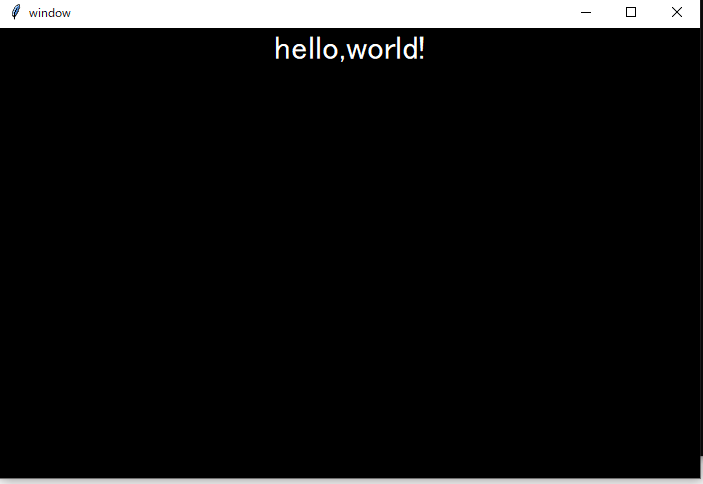

# my porgramming language.
## What's this?
This project is my programming language.made in python.however,it have some bugs.so if you send Pull requests or a issue to this repository,I'm happy.Send a Pull requests or issue,please. :)

## How to coding?

### Hello,world!
```
print>"Hello,world!";
```
### if
```
if,1=1{print>"Hello,world!";}
```
```
if,1<2{print>"Hello,wold!";}
```
### loop
```
loop,5{print>"Hello,world!";}
```
### variable
```
a = 5;
b = a+5;
c = "hello,world!"a;
print>"c="c;
```
### Setting background color red
```
background>"#f00";
```
### Text color
```
text_color>"#f00";
```

## How to run?

Run this code at python.
```
code(lexer(" here code "))
```
